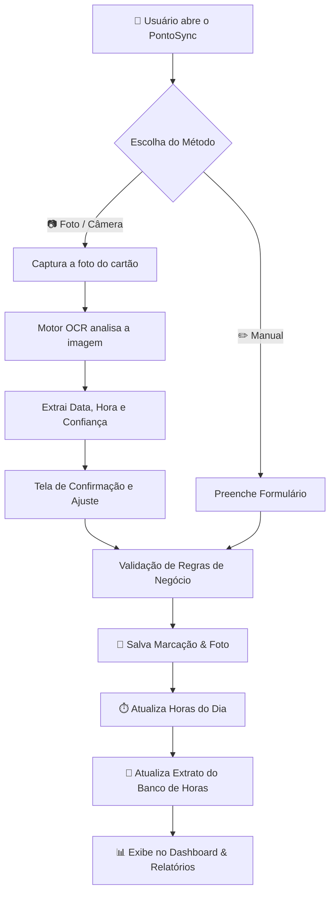
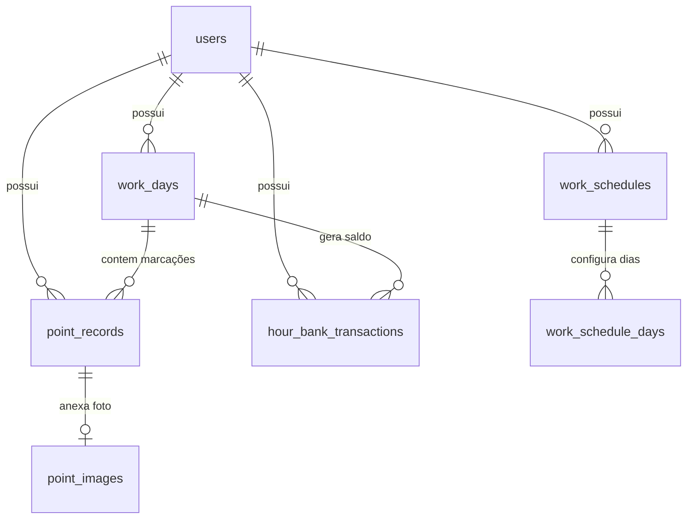

# 🕐 PontoSync — Sistema Web de Registro de Ponto com OCR

> Sistema web simples, responsivo e **mobile-first** para registrar, validar e acompanhar jornadas de trabalho e banco de horas utilizando reconhecimento óptico de caracteres (**OCR**) e lançamentos manuais.

[](https://laravel.com)
[](https://php.net)
[](https://tailwindcss.com)
[](https://www.mysql.com)
[](LICENSE)
[](.github/workflows/ci.yml)

---

## 📖 O que é o PontoSync e O Que Ele Faz?

O **PontoSync** foi desenvolvido com foco na experiência do colaborador que precisa registrar seus horários de trabalho direto do smartphone com máxima agilidade e sem complicações.

### 🎯 Principais Objetivos e Funcionalidades

1. **📷 Registro de Ponto por Foto (OCR):**
   - O usuário abre a câmera do celular ou envia uma foto do seu espelho/cartão físico de ponto.
   - O motor de **OCR** analisa a imagem e identifica automaticamente a **data** e o **horário** da batida com nível de confiança (Alto, Médio ou Baixo).
   - O colaborador valida as informações identificadas na tela, podendo ajustar qualquer dado antes de salvar definitivamente.

2. **✏️ Registro Manual:**
   - Formulário simples e direto para lançamento manual com validações completas de formato 24h e formato de data brasileira (`DD/MM/AAAA`).

3. **🕐 4 Marcações Diárias Padronizadas:**
   - 🟢 **Entrada**
   - 🟠 **Saída para Almoço**
   - 🔵 **Retorno do Almoço**
   - 🔴 **Saída / Fim do Expediente**

4. **⏱️ Cálculo Preciso de Horas e Banco de Horas:**
   - Horários e saldos são manipulados em **minutos inteiros** no backend (eliminando erros clássicos de arredondamento por números `float`).
   - Cálculo automático do período matutino (`saída almoço - entrada`), vespertino (`saída - retorno almoço`) e total trabalhado.
   - Comparação diária contra a jornada prevista (ex: 8h ou 9h) gerando saldo diário positivo (`+HH:MM`), negativo (`-HH:MM`) ou neutro (`+00:00`).
   - Extrato contínuo e acumulado do **Banco de Horas**.

5. **📱 Experiência Mobile-First:**
   - Interface com botões grandes, navegação inferior fixa (Bottom Navigation Bar) inspirada em aplicativos nativos, cards visuais e layout adaptativo para smartphones, tablets e desktops.

6. **📊 Histórico e Relatórios com Exportação:**
   - **Histórico Completo**: filtros por mês, ano e intervalo de datas.
   - **Relatório Mensal**: visão consolidada de dias trabalhados, horas previstas, horas trabalhadas, saldo do mês e saldo acumulado.
   - **Exportações**: geração de **PDF formatado para impressão** (com campo para assinatura do colaborador e gestor) e **CSV / Excel**.

7. **🛡️ Auditoria e Rastreabilidade:**
   - Diferenciação visual e estrutural entre registros manuais, via OCR ou corrigidos posteriormente.
   - Preservação do horário original antes de correções para fins de auditoria trabalhista.

---

## 🔄 Fluxo de Funcionamento



---

## 🛠️ Stack Tecnológica

| Camada | Tecnologia | Detalhes |
|---|---|---|
| **Backend** | **PHP 8.3+** & **Laravel 11** | Arquitetura com Services, DTOs e Contracts |
| **Frontend** | **Blade**, **Tailwind CSS 3**, **Alpine.js** | Mobile-first com design moderno e responsivo |
| **Banco de Dados** | **MySQL 8.0+** | Migrations com constraints e tipos otimizados |
| **OCR** | **Abstração Modular** | `FakeOcrService` (dev) & `GoogleCloudVisionOcrService` (prod) |
| **Manipulação de Imagens** | **Intervention Image** | Redimensionamento e compressão automática |
| **Exportações** | **DomPDF** & **Maatwebsite Excel** | Relatórios em PDF e planilhas |
| **Testes** | **PestPHP** | Testes automatizados unitários e de feature |
| **CI / CD** | **GitHub Actions** | Pipelines automatizados de Lint, Testes e Deploy |

---

## 🗄️ Estrutura do Banco de Dados



### Tabelas Principais

- `users`: Usuários do sistema.
- `work_schedules`: Jornadas semanais cadastradas.
- `work_schedule_days`: Definição de horários previstos para cada dia da semana (Segunda a Domingo).
- `work_days`: Dia de trabalho único por usuário/data, consolidando status (`incomplete`, `complete`), minutos trabalhados e saldo.
- `point_records`: Registro das 4 batidas diárias (`entry`, `lunch_start`, `lunch_end`, `exit`) com tipo de origem (`manual`, `ocr`, `correction`).
- `point_images`: Fotos vinculadas às marcações, armazenando metadados e caminho no storage.
- `hour_bank_transactions`: Extrato financeiro de minutos no banco de horas.

---

## 📏 Regras de Negócio Implementadas

| Regra | Descrição |
|---|---|
| **RN01** | Uma jornada pertence exclusivamente a um usuário autenticado. |
| **RN02** | Uma data possui no máximo uma jornada diária consolidada (`work_days`). |
| **RN03** | Uma jornada possui no máximo quatro marcações padrão por dia. |
| **RN04** | A sequência padrão de batidas é: `Entrada` → `Saída Almoço` → `Retorno Almoço` → `Saída`. |
| **RN05** | Não é permitido registrar o retorno do almoço sem a respectiva saída para almoço. |
| **RN06** | Não é permitido registrar a saída final antes do horário de entrada. |
| **RN07** | Validação cronológica estrita entre os horários registrados. |
| **RN08** | Registros manuais são tagueados como `source = 'manual'`. |
| **RN09** | Registros via OCR são tagueados como `source = 'ocr'` e guardam a confiança do reconhecimento. |
| **RN10** | Fotografias são otimizadas e vinculadas ao registro com armazenamento seguro. |
| **RN11** | O banco de horas e o tempo trabalhado operam em minutos inteiros. |
| **RN12** | O sistema permite corrigir marcações, mantendo o valor original auditável. |

---

## 🚀 Como Executar o Projeto Localmente

### 1. Pré-requisitos
- **PHP >= 8.3** (com extensões `pdo_mysql`, `gd`, `exif`, `fileinfo`, `mbstring`, `xml`)
- **Composer >= 2.x**
- **MySQL >= 8.0**

### 2. Clonar o Repositório
```bash
git clone https://github.com/luizcsbh/pontosync.git
cd pontosync
```

### 3. Instalar Dependências
```bash
composer install
```

### 4. Configurar Variáveis de Ambiente
Copie o arquivo de exemplo:
```bash
cp .env.example .env
```

Edite o `.env` com suas credenciais do MySQL:
```env
DB_CONNECTION=mysql
DB_HOST=127.0.0.1
DB_PORT=3306
DB_DATABASE=pontosync
DB_USERNAME=root
DB_PASSWORD=root@123

# Configuração do OCR (fake para testes ou google_vision para produção)
OCR_PROVIDER=fake
OCR_CONFIDENCE_HIGH=0.90
OCR_CONFIDENCE_MEDIUM=0.70
OCR_AUTO_CONFIRM=false
```

Gere a chave da aplicação:
```bash
php artisan key:generate
```

### 5. Executar Migrações e Seeders
```bash
php artisan migrate:fresh --seed
```

### 6. Criar Link Simbólico do Storage
```bash
php artisan storage:link
```

### 7. Iniciar o Servidor
```bash
php artisan serve
```

Acesse no navegador ou celular: **[http://localhost:8000](http://localhost:8000)**

---

## 👤 Usuários e Credenciais Padrão (Seeders)

O seeder já cria usuários pré-configurados e 10 dias úteis de marcações com histórico do banco de horas:

| Colaborador | E-mail | Senha | Perfil |
|---|---|---|---|
| **Luiz Santos** | `luiz@pontosync.test` | `password` | Usuário Principal com histórico populado |
| **Maria Silva** | `maria@pontosync.test` | `password` | Usuário Teste |

---

## 🧪 Executando os Testes Automatizados

O projeto conta com suite completa de testes utilizando **PestPHP**:

```bash
# Executar todos os testes
php artisan test

# Ou diretamente via Pest
./vendor/bin/pest
```

---

## 📁 Estrutura de Diretórios

```
pontosync/
├── app/
│   ├── Contracts/              # Interfaces (OcrServiceInterface, FileStorageInterface)
│   ├── Http/
│   │   ├── Controllers/        # Dashboard, PointRecord, Ocr, History, Report, HourBank, Auth
│   │   └── Requests/           # Validações de formulário (StorePointRecordRequest, etc.)
│   ├── Models/                 # User, WorkSchedule, WorkDay, PointRecord, PointImage, HourBankTransaction
│   └── Services/
│       ├── Ocr/                # FakeOcrService, GoogleCloudVisionOcrService, OcrResult DTO
│       ├── Storage/            # LocalFileStorageService
│       ├── PointRecordService.php # Regras de validação e criação de marcações
│       ├── WorkDayService.php     # Cálculos diários e jornada
│       ├── HourBankService.php    # Consolidação e extrato do banco de horas
│       └── ImageService.php       # Otimização e compressão de imagens
├── config/
│   └── ocr.php                 # Configurações de provedor e confiança do OCR
├── database/
│   ├── migrations/             # Migrações das tabelas do sistema
│   └── seeders/                # População de usuários, jornadas e histórico
├── resources/
│   └── views/                  # Layouts e telas Blade mobile-first
│       ├── auth/               # Login
│       ├── dashboard/          # Painel principal
│       ├── point-records/      # Criação por foto/manual e edição
│       ├── history/            # Tabela de histórico com filtros
│       ├── hour-bank/          # Extrato do banco de horas
│       ├── work-schedules/     # Configuração da jornada semanal
│       └── reports/            # Relatório mensal, semanal e template PDF
└── tests/
    ├── Feature/                # Testes de integração de rotas e controllers
    └── Unit/                   # Testes unitários dos serviços e regras de cálculo
```

---

## 📄 Licença

Este projeto está sob a licença **MIT**. Veja o arquivo [LICENSE](LICENSE) para mais detalhes.

---

## 👨‍💻 Autor

Desenvolvido por **Luiz Santos** — [@luizcsbh](https://github.com/luizcsbh)
